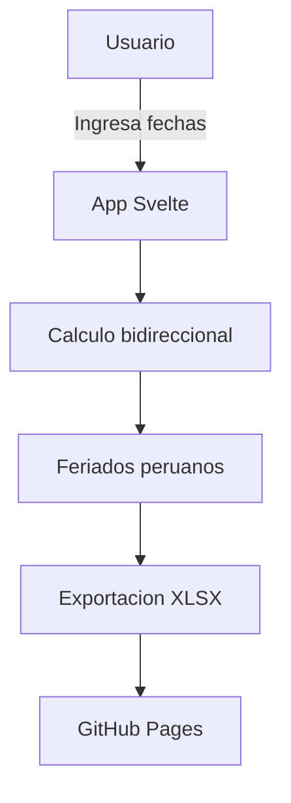

# G360 Day Calculator

<picture>
  <source media="(prefers-color-scheme: dark)" srcset="public/assets/images/logo-g360-light.svg">
  
</picture>

> Calculadora de dias habiles con feriados peruanos. Calcula dias calendario considerando feriados fijos y moviles (Semana Santa).

[](https://github.com/carloscus/g360-day-calculator)
[](https://svelte.dev)
[](LICENSE)



---

## Tabla de Contenidos

- [Descripcion](#descripcion)
- [Caracteristicas](#caracteristicas)
- [Tecnologias](#tecnologias)
- [Estructura](#estructura)
- [Instalacion](#instalacion)
- [Desarrollo](#desarrollo)
- [Despliegue](#despliegue)
- [Contribucion](#contribucion)
- [Licencia](#licencia)
- [Familia G360](#familia-g360)

---

## Descripcion

Aplicacion web PWA para calcular dias habiles considerando feriados peruanos fijos y moviles (Semana Santa). Permite calculo bidireccional: ingresa una fecha y obtiene los dias de diferencia, o ingresa dias y obtiene la fecha resultante.

**Tipo**: Web App (PWA)
**Framework**: Svelte 5 + Vite 6
**Compatibilidad**: Todos los navegadores modernos

---

## Caracteristicas

- **Calculo bidireccional**: ingresa una fecha y obtiene los dias de diferencia, o ingresa dias y obtiene la fecha resultante
- **Feriados peruanos**: carga automatica con feriados fijos y Semana Santa (algoritmo Gauss)
- **Acciones rapidas**: botones predefinidos para 45, 60, 75, 90, 108 y 120 dias, plus grupos (45/60, 45/60/75, etc.)
- **+2 dias despacho**: suma 2 dias habiles adicionales al resultado (toggle)
- **Exportacion XLSX**: descarga el reporte con 5 columnas y estilo zebra via ExcelJS
- **Copia al portapapeles**: copia rapida de todos los resultados
- **Modo oscuro**: toggle con persistencia en localStorage y deteccion de preferencia del sistema
- **PWA**: instalable como aplicacion con service worker
- **Atajos de teclado**:
  - `Ctrl+N` nueva fila
  - `Ctrl+E` exportar XLSX
  - `Ctrl+L` limpiar campos
  - `Ctrl+D` modo oscuro

---

## Tecnologias

| Capa | Tecnologia |
|---|---|
| Framework | Svelte 5 + Vite 6 |
| Language | TypeScript |
| Excel | ExcelJS |
| Icons | Bootstrap Icons (CDN) |
| Fonts | Inter + Roboto Mono (Google Fonts) |
| PWA | Custom service worker + manifest |
| Deploy | gh-pages |

---

## Estructura

```
g360-day-calculator/
├── src/
│   ├── App.svelte          # Componente principal (estado, logica, UI)
│   ├── main.ts             # Bootstrap + registro service worker
│   ├── app.css             # Estilos globales y utilidades
│   └── lib/
│       ├── utils.ts        # Funciones de calculo y formato de fechas
│       ├── types.ts        # Interfaces Feriado, CalculationRow
│       ├── LogoG360.svelte # Logo SVG con variantes light/dark
│       └── HolidaysModal.svelte  # Modal de lista de feriados
├── public/
│   ├── feriados.json       # Feriados peruanos fijos
│   ├── g360-theme.css      # Design system G360 (tokens, colores, componentes)
│   ├── g360-signature.js   # Web Component footer G360
│   ├── g360-sw.js          # Service Worker PWA
│   └── g360-manifest.json  # PWA manifest
└── package.json
```

---

## Instalacion

```bash
git clone https://github.com/carloscus/g360-day-calculator.git
cd g360-day-calculator
npm install
```

---

## Desarrollo

```bash
# Servidor de desarrollo (http://localhost:3000)
npm run dev

# Verificar tipos
npm run check

# Build de produccion
npm run build

# Previsualizar build
npm run preview
```

---

## Despliegue

```bash
npm run deploy    # publica en GitHub Pages via gh-pages
```

El proyecto se despliega automaticamente en la rama `gh-pages` del repositorio.

---

## Contribucion

1. Fork el repositorio
2. Crea una rama (`git checkout -b feature/nueva-funcion`)
3. Commit cambios (`git commit -m 'Agregar funcion'`)
4. Push a la rama (`git push origin feature/nueva-funcion`)
5. Abre un Pull Request

---

## Licencia

MIT License - ver [LICENSE](LICENSE) para mas detalles.

---

## Familia G360

Este proyecto forma parte de la familia de microherramientas **G360** para apoyo CRM y gestion de datos en escritorio, enfocadas en areas como ventas, finanzas y logistica.

### Herramientas Relacionadas

- **[g360-cli](https://github.com/carloscus/g360-cli)**: CLI para bootstrap de proyectos G360
- **[g360-signature](https://github.com/carloscus/g360-signature)**: Web component de branding G360
- **[g360-order-xlsx](https://github.com/carloscus/g360-order-xlsx)**: Generador de cotizaciones Excel
- **[g360-signature-creator](https://github.com/carloscus/g360-signature-creator)**: Generador de firmas corporativas

---

**Marca**: G360
**Isotipo**: 3 puntos verticales paralelos (gris-verde-gris) + chevron `>`
**Autor**: Carlos Cusi
**Desarrollo**: Con asistencia de herramientas de codigo IA (Vibe Code)
**Powered by**: [g360-signature](https://github.com/carloscus/g360-signature)
